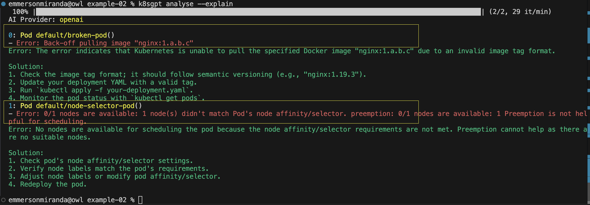
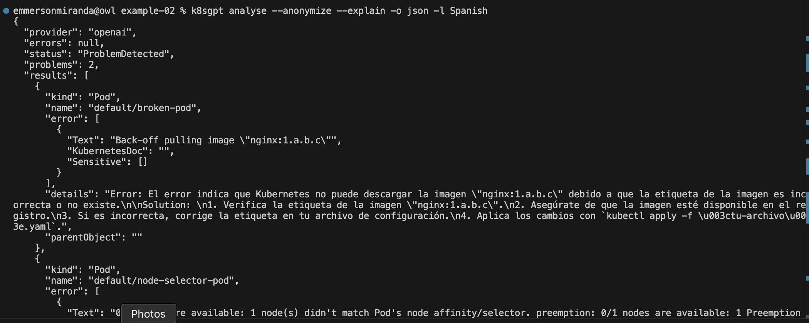

# K8S GPT Command Line

Uses command line to analyse problem in the cluster.

## Steps:
- [Create KinD cluster](../example-01/clusters-create.sh)
- [Configure Command line and deploy some pod examples](./configure.sh)
- Analyze what happens in the cluster:
  - k8sgpt analyse --explain

## Analysis:
K8sGPT analyse the cluster and highlight two problems and suggest solutions for each of them.

There is other features, just to mention some:
- Explain the problem to me
- Anonymize data before sending it to the AI backend
- Specify which languages to use for AI
- Change the output format from Texto to JSON

`k8sgpt analyse --explain`

`k8sgpt analyse --anonymize --explain -o json -l Spanish`
